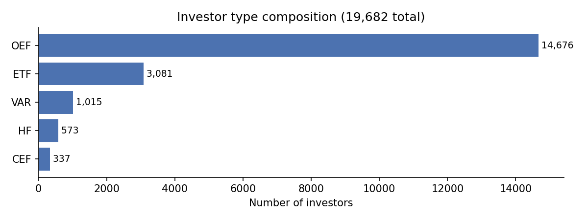
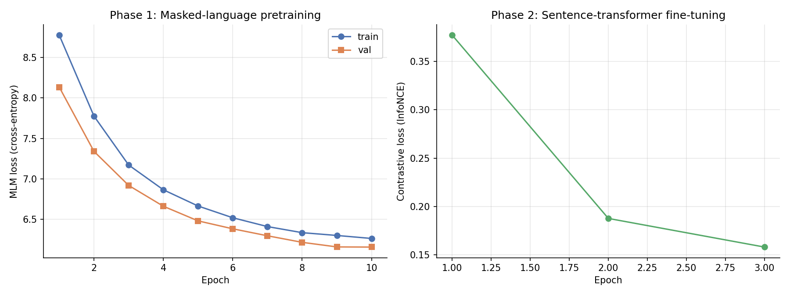

# Investor Embeddings from Institutional Holdings — Progress Report

## 1. Project Objective

The project replicates and extends the PS-BERT architecture introduced in Gabaix and Koijen (2025) to learn dense vector representations of institutional investors from their quarterly portfolio holdings. Each investor is treated analogously to a sentence in natural language: a sequence of issuer tokens ordered by portfolio weight. A small BERT model is trained per quarter with a masked-token prediction objective followed by a sentence-transformer fine-tuning step. The mean-pooled contextualised output is the investor embedding.

The eventual goal is to use these embeddings to detect crowded trades, defined as stocks disproportionately held by clusters of investors with similar holdings profiles, and to test whether crowding predicts subsequent drawdowns or underperformance.

---

## 2. Data Pipeline (`Data_Cleaning.r`)

### 2.1 Source data

The dataset is constructed from the WRDS Postgres mirror of FactSet Ownership Data, accessed through `dbplyr` and `RPostgres`. Four tables are queried:

| Table | Content |
|---|---|
| `factset_own.wrds_own_13f` | Quarterly 13F filings (hedge funds) |
| `factset_own.wrds_own_fund` | Fund-level holdings (registered funds) |
| `factset_own.own_ent_funds` | Fund-type classification (OEF, ETF, CEF, VAR) |
| `factset_own.own_sec_entity_eq` | CUSIP-to-issuer entity mapping |

All security positions are rolled up to the issuer-entity level rather than CUSIP, so multiple share classes of the same firm collapse to a single token.

### 2.2 Coverage

The panel covers 2005-Q1 through 2025-Q4, producing **85 quarterly files** at `data/q_YYYY-MM-DD.parquet`, one file per quarter-end date.

A minor labelling artifact is present in the generated filenames. The R `seq.Date(by = "quarter")` function, starting from `2005-03-31`, rolls invalid date arithmetic forward by one day, so Q2 and Q3 files are labelled with `07-01` and `10-01` instead of `06-30` and `09-30`. The data inside the files is correct: the ±5 / ±7 day extraction windows still capture the appropriate quarter-end reports. Only the `quarter_end` column and the filenames are off by one day for those quarters. The fix is straightforward and will be applied before any temporal joins to returns data.

### 2.3 Extraction

For each quarter-end, two separate streams are pulled and stacked.

**13F holdings (hedge funds only)** are filtered by `entity_sub_type = "HF"`, report dates within ±7 days of the quarter-end, and `adj_mv > 0`. After joining to the issuer-mapping table, positions are aggregated to `(investor_id, issuer_id)` by summing reported dollar value.

**Fund holdings** cover four vehicle types (OEF, ETF, CEF, VAR). Report dates are restricted to ±5 days of the quarter-end. Because funds typically report more often than quarterly, duplicates are resolved by keeping the latest report per (investor, issuer) sorted descending by `(report_date, filing_date, transfer_date, form_type)`. The remaining positions are then aggregated the same way as 13F.

The two streams are concatenated vertically into a single long-format holdings table with one row per (investor, quarter, issuer).

### 2.4 Filtering

Three sequential filters reduce the panel.

1. **Concentration filter.** Any (investor, quarter) where the largest single position exceeds 75% of the portfolio is dropped (`MAX_TOP1_PCT = 0.75`). This removes effectively single-stock vehicles.
2. **Bipartite pruning.** The holdings table is iteratively pruned until every investor-quarter contains at least 20 stocks and every stock-quarter is held by at least 20 investors. This implicitly removes illiquid securities without requiring a separate market-capitalisation filter: a stock held by fewer than 20 institutional investors is by definition thinly held.
3. **No survivorship correction.** Funds that disappear from the panel between quarters are not back-filled. The impact of this on the embedding analysis has not yet been quantified.

### 2.5 Tokenization

Within each (investor, quarter), positions are sorted by portfolio weight in descending order, where the weight is

$$
w_i \;=\; \frac{\text{adj\_mv}_i}{\sum_{j} \text{adj\_mv}_j}.
$$

The resulting ordered list of issuer IDs forms the investor's "sentence."

Sequences longer than 62 tokens (the BERT context window) are split into

$$
k \;=\; \left\lceil \frac{N}{62} \right\rceil
$$

equal-sized chunks by the helper function `chunk_seq`. A 137-position portfolio becomes three rows of 46, 46 and 45 tokens; a 112-position portfolio becomes two rows of 56 tokens each. All chunks share the same `investor_id` and `quarter_end`, and their `tokens` lists are disjoint slices that together reconstruct the full portfolio.

### 2.6 Output schema

One parquet per quarter is written to `data/q_YYYY-MM-DD.parquet` with the following columns:

| Column | Type | Description |
|---|---|---|
| `quarter_end` | date | Quarter-end date |
| `investor_id` | string | FactSet entity or fund identifier |
| `investor_type` | string | One of HF, OEF, ETF, CEF, VAR |
| `tokens` | list&lt;string&gt; | Issuer IDs, weight-ordered, length ≤ 62 |
| `n_tokens` | int | Length of `tokens` |
| `n_assets_full` | int | Full portfolio size before chunking |

A representative row from a single-chunk hedge-fund investor:

```json
{
  "quarter_end":    "2019-10-01",
  "investor_id":    "000C65-E",
  "investor_type":  "HF",
  "tokens":         ["06QJY3-E", "000LHL-E", "002X70-E", "0FM7LR-E", "..."],
  "n_tokens":       27,
  "n_assets_full":  27
}
```

Tokens are FactSet entity codes; the first token in the list is the position with the largest portfolio weight.

---

## 3. Model Pipeline (`BERT_training.py`)

### 3.1 Per-quarter independent training

Each quarter is trained independently. There is no weight sharing across quarters, and each quarter has its own vocabulary. This matches the baseline design of Gabaix and Koijen (2025).

### 3.2 Architecture

A small BERT model is constructed using Hugging Face `BertConfig` with the following parameters:

| Parameter | Value |
|---|---|
| Hidden size $d$ | 64 |
| Hidden layers | 4 |
| Attention heads | 2 |
| Intermediate (FFN) size | 256 |
| Context window | 62 tokens |
| Max position embeddings | 64 (`[CLS]` + 62 + `[SEP]`) |
| Type vocabulary size | 1 |

Per-quarter checkpoints are approximately 2.2 MB on disk.

### 3.3 Vocabulary

Each quarter has its own vocabulary, comprising four special tokens (`[PAD]`, `[CLS]`, `[SEP]`, `[MASK]`) plus every unique issuer ID appearing in that quarter's tokenized data. The 2019-Q3 vocabulary contains approximately 11,900 tokens.

### 3.4 Masked-language-model pre-training

The first training stage applies the standard BERT masked-language-model objective to portfolio sequences. For each batch:

- 15% of body tokens are sampled for masking.
- Of those, 80% are replaced with `[MASK]`, 10% are replaced with a random non-special token, and 10% are kept unchanged.
- Labels equal the original token ID at masked positions and $-100$ elsewhere (ignored by the loss).

The cross-entropy loss is averaged over masked positions only:

$$
\mathcal{L}_{\text{MLM}} \;=\; -\frac{1}{|M|} \sum_{i \in M} \log \Pr\!\left( t_i \;\middle|\; \mathbf{t}_{\setminus M} \right),
$$

where $M$ is the set of masked positions in the sequence, $t_i$ is the true token at position $i$, and $\mathbf{t}_{\setminus M}$ denotes the visible (un-masked) context.

Training configuration:

| Parameter | Value |
|---|---|
| Epochs | 10 |
| Optimiser | AdamW |
| Learning rate | $5 \times 10^{-4}$ |
| Weight decay | 0.01 |
| LR schedule | Cosine with 10% warmup |
| Batch size | 64 |
| Train / validation split | 90 / 10 |
| Gradient clipping | Max norm 1.0 |

The split is constructed by `investor_id`, not by chunk, so multiple chunks belonging to the same investor are never assigned to different sides of the split. This prevents an investor's other chunks from leaking into the validation set.

### 3.5 Sentence-transformer fine-tuning

The second stage applies siamese contrastive learning. For each investor in a batch, the tokens are split into even-rank and odd-rank halves, which become a positive pair: different positions of the same investor. Negatives are drawn implicitly via the rest of the batch.

Let $(\mathbf{a}_i, \mathbf{b}_i)$ denote the mean-pooled embeddings of the two halves of investor $i$ in a batch of size $N$. The symmetric in-batch contrastive loss is

$$
\mathcal{L}_{\text{NCE}} \;=\; -\frac{1}{2N}\sum_{i=1}^{N} \!\left[
\log\!\frac{\exp\!\big(\tau\,\cos(\mathbf{a}_i, \mathbf{b}_i)\big)}{\sum_{j=1}^{N}\exp\!\big(\tau\,\cos(\mathbf{a}_i, \mathbf{b}_j)\big)}
\;+\;
\log\!\frac{\exp\!\big(\tau\,\cos(\mathbf{a}_i, \mathbf{b}_i)\big)}{\sum_{j=1}^{N}\exp\!\big(\tau\,\cos(\mathbf{a}_j, \mathbf{b}_i)\big)}
\right],
$$

with temperature $\tau = 20$ (equivalently, the softmax is taken over cosine similarities divided by $1/20$).

| Parameter | Value |
|---|---|
| Epochs | 3 |
| Optimiser | AdamW |
| Learning rate | $2 \times 10^{-4}$ |
| Temperature $\tau$ | 20 |

### 3.6 Embedding extraction

After fine-tuning, each investor's first chunk (the top 62 positions by weight) is passed through the model. The final-layer contextualised output $\mathbf{h}_{i,j} \in \mathbb{R}^{64}$ at position $j$ is mean-pooled over non-pad positions to produce a single 64-dimensional embedding per investor per quarter:

$$
\mathbf{e}_i \;=\; \frac{1}{|\mathcal{P}_i|} \sum_{j \in \mathcal{P}_i} \mathbf{h}_{i,j},
\qquad \mathcal{P}_i = \{j : \text{token}_{i,j} \neq \texttt{[PAD]}\}.
$$

Multi-chunk investors discard chunks 2 onwards at extraction time. Those chunks contribute to pre-training and fine-tuning but not to the final embedding. This matches the design described in the original paper.

Outputs:

- `embeddings/q_YYYY-MM-DD.parquet`, with columns `investor_id, investor_type, quarter_end, dim_000, ..., dim_063`.
- `models/q_YYYY-MM-DD/`, containing the tokenizer and the model checkpoints.

---

## 4. Results for 2019-Q3

The 2019-Q3 quarter was used as the dress-rehearsal quarter to validate the full pipeline before launching the panel-wide sweep. All numbers reported in this section come from `embeddings/q_2019-10-01.parquet` and the corresponding training run. The filename uses `2019-10-01` rather than the calendar quarter-end `2019-09-30` because of the R `seq.Date` rollover artifact documented in §2.2; the underlying data still represents 2019-Q3.

### 4.1 Investor distribution

After all filtering, 2019-Q3 contains **19,682 investors**.

| Investor type | Count | Share |
|---|---:|---:|
| OEF (open-end fund) | 14,676 | 74.6% |
| ETF | 3,081 | 15.7% |
| VAR (variable annuity) | 1,015 | 5.2% |
| HF (hedge fund) | 573 | 2.9% |
| CEF (closed-end fund) | 337 | 1.7% |
| **Total** | **19,682** | **100.0%** |

<!-- PLACEHOLDER: insert type_distribution.png here -->


The distribution is heavily skewed toward open-end mutual funds, reflecting the structural composition of the institutional fund universe rather than any sampling bias. Hedge funds are a small minority of the panel because the 13F filing universe is restricted to filers with at least \$100m in assets under management.

### 4.2 Sequence statistics

After tokenization and chunking, the 19,682 investors generate a total of **57,391 training sequences** because investors with more than 62 holdings are split into multiple chunks. Each sequence corresponds to one (investor, chunk) row in `data/q_2019-10-01.parquet`. For embedding extraction, only one sequence per investor is used: the first chunk, which contains the investor's top 62 positions sorted by portfolio weight.

The portfolio-size distribution is highly right-skewed. The median investor holds 53 stocks (just below the 62-token context window), but the mean is 152.4 and the largest portfolio in the quarter contains 8,929 positions.

| Statistic | Holdings per investor |
|---|---:|
| Mean | 152.4 |
| Median | 53 |
| Min | 20 |
| Max | 8,929 |
| 75th percentile | 107 |
| 90th percentile | 349 |
| 99th percentile | 1,626 |
| Investors with more than 62 holdings | 8,366  (42.5%) |

The 42.5% multi-chunk fraction quantifies the practical importance of the chunking step: nearly half of the panel cannot be fully represented in a single 62-token sequence, and the largest portfolios require well over a hundred chunks each.

Portfolio sizes vary substantially across investor types, reflecting different vehicle structures and mandates:

| Investor type | Mean | Median | Max |
|---|---:|---:|---:|
| VAR (variable annuity) | 281.0 | 95 | 8,929 |
| ETF | 242.1 | 90 | 7,450 |
| HF (hedge fund) | 184.5 | 46 | 3,165 |
| OEF (open-end fund) | 125.4 | 50 | 6,058 |
| CEF (closed-end fund) | 67.4 | 50 | 504 |

Variable annuity funds and ETFs carry the largest mean portfolios, consistent with their highly diversified mandates and the prevalence of broad-market index vehicles among them. Hedge funds show a low median (46) but a high mean (184.5), reflecting a barbell distribution between concentrated stock-pickers and large multi-strategy books. Closed-end funds are the smallest and most uniformly sized group.

### 4.3 Pre-training metrics

The MLM loss decreases monotonically across the 10 epochs.

| Epoch | Train loss | Validation loss |
|:---:|:---:|:---:|
| 1 | 8.78 | 8.13 |
| 5 | 6.67 | 6.48 |
| 10 | 6.27 | 6.16 |



For context, the random-prediction baseline on a vocabulary of $|V| \approx 11{,}900$ tokens is

$$
\mathcal{L}_{\text{MLM}}^{\text{rand}} \;=\; \ln |V| \;\approx\; \ln(11{,}900) \;\approx\; 9.4.
$$

The final loss of 6.16 reflects substantive learning: the model's prediction loss is reduced by roughly one third below the random baseline.

Train and validation losses track closely throughout training, with validation consistently slightly below train. This is the expected artifact of dropout being active only at training time. There is no sign of overfitting at 10 epochs, and the curve is still trending downward, which suggests that additional epochs could yield further marginal improvement.

Throughput on an NVIDIA A30 GPU with bf16 mixed precision is approximately 3,737 samples per second. The full 10-epoch pre-training completes in 139 seconds.

### 4.4 Fine-tuning metrics

The siamese contrastive loss over three epochs:

| Epoch | Loss |
|:---:|:---:|
| 1 | 0.38 |
| 2 | 0.19 |
| 3 | 0.16 |

The random baseline for in-batch contrastive learning with batch size $N = 64$ is

$$
\mathcal{L}_{\text{NCE}}^{\text{rand}} \;=\; \ln N \;=\; \ln(64) \;\approx\; 4.16.
$$

The starting loss of 0.38 is already well below random, because the pre-trained model has already learned that two halves of the same portfolio are more similar than two halves drawn from different investors. Fine-tuning sharpens this representation, reducing the loss by approximately 58% over the three epochs.

### 4.5 Embedding distribution

The final output contains $19{,}682$ rows $\times$ $64$ dimensions. Distributional properties:

- **L2 norms**: mean $\approx 4.9$, standard deviation $\approx 0.5$, range $[2.8,\, 6.8]$. No zero-norm vectors.
- **Per-dimension standard deviation**: every dimension has $\sigma \geq 0.33$, with the most active dimension at $\sigma = 0.84$. All 64 dimensions carry signal, with no dimensional collapse.
- **Pairwise cosine similarity** (over 5,000 random investor pairs): mean $|\!\cos\!| \approx 0.35$, std $\approx 0.30$, full range $[-0.61,\, 1.00]$. The embedding space is neither collapsed (which would show mean $|\!\cos\!|$ $\approx 1.0$) nor random (which would show mean $|\!\cos\!|$ $\approx 0$).
- **Investor-type structure**: intra-type cosine similarity ($\overline{\cos} = 0.319$) exceeds inter-type cosine similarity ($\overline{\cos} = 0.255$) by $\Delta = +0.064$, where

$$
\Delta \;=\;
\overline{\cos(\mathbf{e}_a, \mathbf{e}_b)}_{\;\text{type}(a)=\text{type}(b)}
\;-\;
\overline{\cos(\mathbf{e}_a, \mathbf{e}_b)}_{\;\text{type}(a)\neq\text{type}(b)}.
$$

The model places same-type investors closer together in embedding space than investors of different types, even though `investor_type` was never used as a training signal.

The $+0.064$ type-discriminability gap is modest in absolute terms, but it provides quantitative confirmation that the embeddings encode an economically interpretable structure derived purely from portfolio composition. The same metric computed on 2005-Q1 is $\Delta \approx -0.012$, suggesting that the type structure encoded in the embeddings has grown over the sample period. A plausible interpretation is the secular rise in institutional portfolio specialisation over the past two decades (the hedge-fund boom, ETF proliferation, and the growth of dedicated style and sector products), but this hypothesis warrants more detailed examination in the next stage of the analysis.
